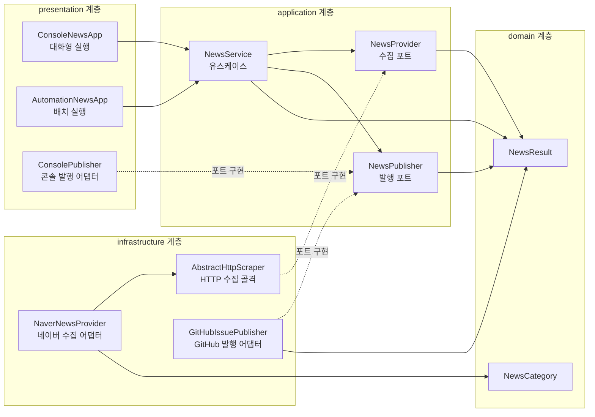

# 네이버 뉴스 스크래퍼

## 프로젝트 개요

- 네이버 뉴스 검색 API 결과 수집 예제
- 로컬 콘솔 검색 및 GitHub Issue 자동 발행 지원
- 약식 클린 아키텍처 기반의 네 계층 분리
- 포트와 어댑터를 통한 뉴스 제공자·발행 방식 교체 가능 구조
- JDK 17 표준 API만 사용
- 외부 라이브러리 및 Maven·Gradle 등 별도 빌드 도구 미사용

## 주요 기능

- 검색어와 검색 개수를 입력받는 대화형 콘솔 실행
- 네이버 뉴스 검색 결과의 제목·링크·발행일·요약 출력
- HTML 태그 및 주요 HTML·숫자 엔티티 정리
- GitHub Actions를 통한 최신 뉴스 검색
- 검색 결과의 GitHub Issue 발행
- 정확도순(`SIM`) 및 최신순(`DATE`) 정렬 지원

## 프로젝트 구조

```text
src/oop/scraper/
├── domain/
│   ├── NewsCategory.java
│   └── NewsResult.java
├── application/
│   ├── NewsProvider.java
│   ├── NewsPublisher.java
│   └── NewsService.java
├── infrastructure/
│   ├── AbstractHttpScraper.java
│   ├── GitHubIssuePublisher.java
│   └── NaverNewsProvider.java
└── presentation/
    ├── AutomationNewsApp.java
    ├── ConsoleNewsApp.java
    └── ConsolePublisher.java
```

## 아키텍처

### 계층별 역할

- `domain`
  - 핵심 데이터와 규칙 정의
  - `NewsResult`: 뉴스 검색 결과 및 문자열 정제 규칙을 담은 record
  - `NewsCategory`: 정확도순·최신순 검색 조건을 담은 enum
- `application`
  - 유스케이스와 포트 정의
  - `NewsProvider`: 뉴스 수집 입력 포트
  - `NewsPublisher`: 검색 결과 발행 출력 포트
  - `NewsService`: 수집과 발행 흐름 조정
- `infrastructure`
  - 외부 시스템 연동 어댑터 구현
  - `AbstractHttpScraper`: HTTP 요청·응답 처리 및 JSON 파싱의 추상 골격
  - `NaverNewsProvider`: 네이버 뉴스 API 수집 어댑터
  - `GitHubIssuePublisher`: GitHub Issue 발행 어댑터
- `presentation`
  - 실행 진입점과 사용자 접점 구성
  - `ConsolePublisher`: 콘솔 출력 어댑터
  - `ConsoleNewsApp`: `Scanner` 기반 대화형 콘솔 앱
  - `AutomationNewsApp`: GitHub Actions용 배치 앱

### 의존성 방향



- 의존성 흐름: `presentation`·`infrastructure` → `application` 포트 → `domain`
- `NewsService`의 구체적인 API 클라이언트 및 출력 방식 미의존
- `NewsProvider` 구현 교체를 통한 다른 뉴스 공급자 연결 가능
- `NewsPublisher` 구현 교체를 통한 파일·메신저 등 다른 발행 방식 연결 가능
- DIP에 따른 안쪽 계층 중심의 의존성 유지 및 OCP에 따른 어댑터 확장 구조

## 실습 구현 순서

1. `domain` 구현
   - `NewsResult` record 작성
   - `NewsCategory` enum 작성
   - 외부 기술과 무관한 핵심 모델 우선 확정
2. `application` 구현
   - `NewsProvider`·`NewsPublisher` 포트 작성
   - `NewsService` 유스케이스 작성
   - 도메인만 바라보는 애플리케이션 경계 및 DIP 방향 확정
3. `infrastructure` 구현
   - `AbstractHttpScraper` 추상 골격 작성
   - `NaverNewsProvider` 수집 어댑터 작성
   - `GitHubIssuePublisher` 발행 어댑터 작성
   - 이미 정의된 포트를 외부 API 기술로 구현하는 단계
4. `presentation` 구현
   - `ConsolePublisher` 출력 어댑터 작성
   - `ConsoleNewsApp` 대화형 콘솔 진입점 작성
   - `AutomationNewsApp` 배치 진입점 작성
   - 포트 구현체를 조립하고 실제 실행 흐름을 완성하는 단계
5. 환경변수 및 IntelliJ 실행 설정
   - `.env.sample`을 복사한 `.env` 작성
   - IntelliJ 실행 구성에서 `.env` 파일 경로 연동
   - 코드와 인증정보를 분리한 로컬 실행 환경 구성 단계
6. GitHub Actions 자동화 구성
   - 워크플로우 작성
   - Repository Secrets·Variables 등록
   - 동일한 유스케이스를 배치 환경의 어댑터 조합으로 실행하는 단계

- 전체 구현 방향: 안쪽 `domain` → `application` 포트 → 바깥쪽 `infrastructure`·`presentation`
- 핵심 정책이 외부 API와 실행 환경을 알지 않도록 유지하는 빌드 순서

## 로컬 실행 준비

### 요구 사항

- JDK 17
- 네이버 개발자 센터에서 발급한 Client ID 및 Client Secret
- IntelliJ IDEA 실행 시 `.env` 파일 연동을 지원하는 Run/Debug Configuration

### 참고 자료

- [네이버 애플리케이션 등록/관리](https://developers.naver.com/apps/#/list): 네이버 뉴스 검색 API용 Client ID·Client Secret 발급 및 관리
- [네이버 뉴스 검색 API 명세](https://developers.naver.com/docs/serviceapi/search/news/news.md#뉴스): 요청 헤더·쿼리 파라미터·응답 형식 확인

### `.env` 생성

1. 프로젝트 루트에서 샘플 파일 복사

   ```shell
   cp .env.sample .env
   ```

2. 생성된 `.env`에 필요한 값 입력

   ```dotenv
   NAVER_CLIENT_ID=
   NAVER_CLIENT_SECRET=
   NEWS_QUERY=
   NEWS_DISPLAY=
   GITHUB_TOKEN=
   GITHUB_REPOSITORY=
   ```

- `.env.sample`과 동일한 키 목록 유지
- 콘솔 실행 필수값: `NAVER_CLIENT_ID`, `NAVER_CLIENT_SECRET`
- 자동화 앱 필수값: `NAVER_CLIENT_ID`, `NAVER_CLIENT_SECRET`, `GITHUB_TOKEN`, `GITHUB_REPOSITORY`
- 자동화 앱 선택값: `NEWS_QUERY`, `NEWS_DISPLAY`
- `NEWS_QUERY` 미설정 시 기본값 `인공지능`
- `NEWS_DISPLAY` 미설정 시 기본값 `10`, 허용 범위 `1`~`100`
- `GITHUB_REPOSITORY` 형식: `owner/repo`
- 인증정보가 포함된 `.env`의 커밋 금지
- 저장소 `.gitignore`에 등록된 `.env` 제외 규칙 사용

## IntelliJ IDEA 실행

1. `Run` → `Edit Configurations...` 선택
2. `Application` 실행 구성 추가
3. Main class에 `oop.scraper.presentation.ConsoleNewsApp` 지정
4. JRE에 17 지정
5. `Environment variables` 설정 창 열기
6. 환경변수 파일 추가 기능에서 프로젝트 루트 `.env`의 절대경로 지정

   ```text
   /{프로젝트 경로}/naver-new-scraper-oop/.env
   ```

7. Working directory에 프로젝트 루트 지정
8. 실행 후 검색 키워드와 검색 개수 입력

- 키-값을 `Environment variables` 필드에 일일이 직접 입력하지 않는 방식
- 실행 구성에서 작업 디렉터리의 `.env` 파일 자체를 가리키는 연동 방식
- IntelliJ 버전에 따라 표시 가능한 항목명 차이
  - `Environment variables files`
  - `Paths to .env files`
  - 환경변수 편집 창의 파일 추가 아이콘

## GitHub Actions 자동화

### Repository 설정

- 경로: `Settings` → `Secrets and variables` → `Actions`
- Repository Secrets 등록
  - `NAVER_CLIENT_ID`
  - `NAVER_CLIENT_SECRET`
- Repository Variables 등록
  - `NEWS_QUERY`
  - `NEWS_DISPLAY`
- GitHub 자동 주입값
  - `GITHUB_TOKEN`: `${{ secrets.GITHUB_TOKEN }}`
  - `GITHUB_REPOSITORY`: `${{ github.repository }}`
- 워크플로우 권한
  - `contents: read`
  - `issues: write`

### 실행 흐름

- 저장소 체크아웃
- Temurin JDK 17 설정
- `javac`를 통한 `src/oop` 전체 컴파일
- `AutomationNewsApp` 실행
- 네이버 뉴스 최신순(`DATE`) 검색
- 검색 결과를 날짜가 포함된 GitHub Issue로 발행
- `workflow_dispatch`를 통한 Actions 탭 수동 실행 지원

### 실행 주기

- 현재 `.github/workflows/news-scraper.yml` 설정: `3,37 * * * *`
- 현재 설정의 실제 실행 주기: 매 30분 (GitHub Actions는 실행 보장을 안하므로 부하 발생 시 스케쥴링은 캔슬되기도 함)
- 크론 작성법 : https://crontab.guru/

## 설계 특징

- `NewsProvider`와 `NewsPublisher` 포트를 생성자로 주입하는 `NewsService`
- 템플릿 메서드 형태로 HTTP 수집 흐름을 고정하는 `AbstractHttpScraper`
- 콘솔 실행 시 정확도순(`NewsCategory.SIM`) 검색
- 자동화 실행 시 최신순(`NewsCategory.DATE`) 검색
- `HttpClient`, record, text block 등 JDK 17 표준 기능 활용
- 외부 JSON·HTTP·DI 라이브러리 없는 학습용 구현
